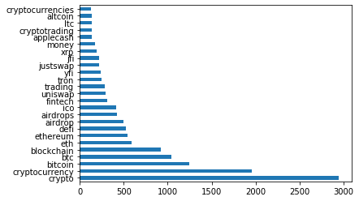

# Chapter 2: Extracting Textual Insights with APIs

## [Blueprints for Text Analysis Using Python](https://github.com/blueprints-for-text-analytics-python/blueprints-text)

**If you like the book or the code examples here, please leave a friendly comment on
[Amazon](https://www.amazon.com/Blueprints-Text-Analytics-Using-Python/dp/149207408X)!**

View Jupyter notebook on 
[[Github]](API_Data_Extraction.ipynb) or
[[nbviewer](https://nbviewer.ipython.org/github/blueprints-for-text-analytics-python/blueprints-text/blob/master/ch02/API_Data_Extraction.ipynb)] or run it on 
[[Colab](https://colab.research.google.com/github/blueprints-for-text-analytics-python/blueprints-text/blob/master/ch02/API_Data_Extraction.ipynb)].

## Figures

Understanding entities mentioned in Tweets discussing cryptocurrency.

Understanding what Formula One teams tweet about and how Mercedes (left) is different from Ferrari (right).

