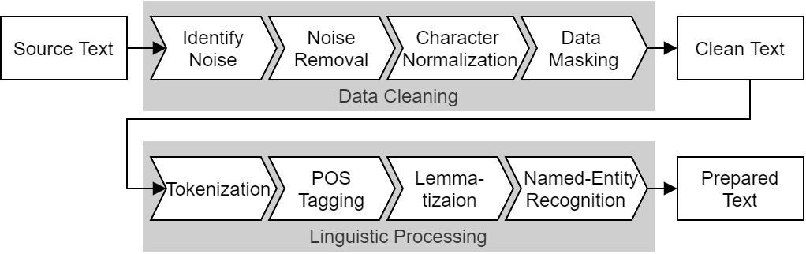

# Chapter 4: Preparing Textual Data For Statistics and Machine Learning

## [Blueprints for Text Analysis Using Python](https://github.com/blueprints-for-text-analytics-python/blueprints-text)

[[Jupyter Notebook]](Data_Preparation.ipynb)  
[[nbviewer](https://nbviewer.ipython.org/github/blueprints-for-text-analytics-python/blueprints-text/blob/master/ch04/Data_Preparation.ipynb)]  
[[colab](https://colab.research.google.com/github/blueprints-for-text-analytics-python/blueprints-text/blob/master/ch04/Data_Preparation.ipynb)]

## Figures

Figure 4.1: A pipeline with typical preprocessing steps for textual data

