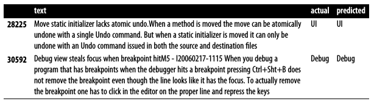

# Chapter 6: Text Classification Algorithms

## [Blueprints for Text Analysis Using Python](https://github.com/blueprints-for-text-analytics-python/blueprints-text)

**If you like the book or the code examples here, please leave a friendly comment on
[Amazon](https://www.amazon.com/Blueprints-Text-Analytics-Using-Python/dp/149207408X)!**

View Jupyter notebook on 
[[Github]](Text_Classification.ipynb) or
[[nbviewer](https://nbviewer.ipython.org/github/blueprints-for-text-analytics-python/blueprints-text/blob/master/ch06/Text_Classification.ipynb)] or run it on 
[[Colab](https://colab.research.google.com/github/blueprints-for-text-analytics-python/blueprints-text/blob/master/ch06/Text_Classification.ipynb)].

## Figures

An example of how bugs have been automatically classified into the architecture components they were reported in using the Java Development Toolkit (JDT) bugs dataset.

