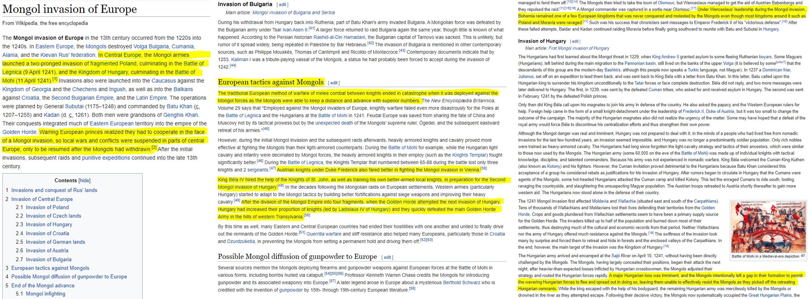
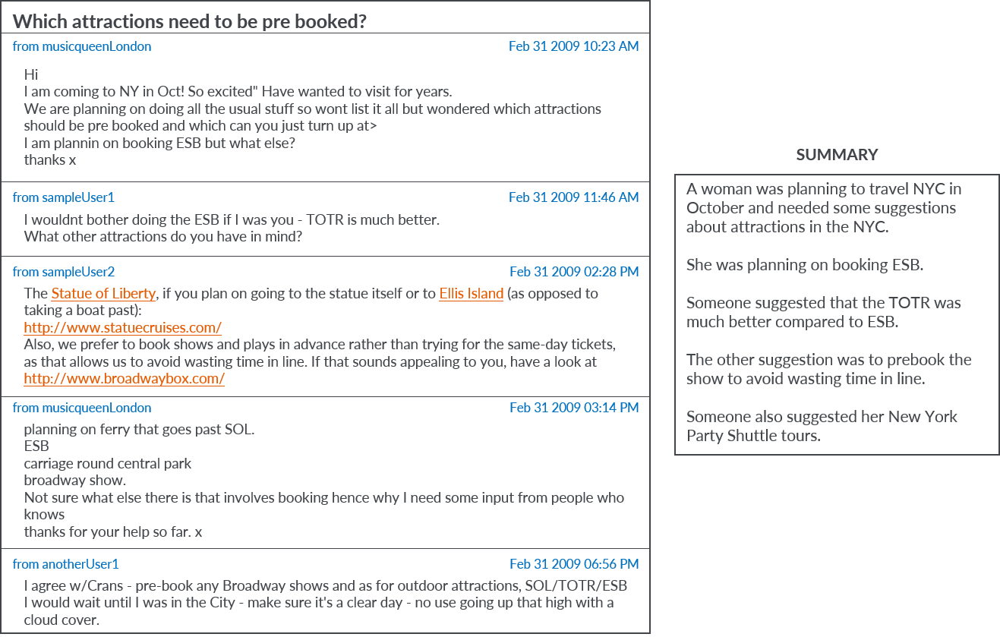

# Chapter 9: Text Summarization

## [Blueprints for Text Analysis Using Python](https://github.com/blueprints-for-text-analytics-python/blueprints-text)

View Jupyter notebook on 
[[Github]](Text_Summarization.ipynb) or
[[nbviewer](https://nbviewer.ipython.org/github/blueprints-for-text-analytics-python/blueprints-text/blob/master/ch09/Text_Summarization.ipynb)] or run it on 
[[Colab](https://colab.research.google.com/github/blueprints-for-text-analytics-python/blueprints-text/blob/master/ch09/Text_Summarization.ipynb)].

## Figures

Illustration of a summarization technique on long-form text like a Wikipedia page

Illustration of a technique that summarizes threads in a travel discussion forum 

