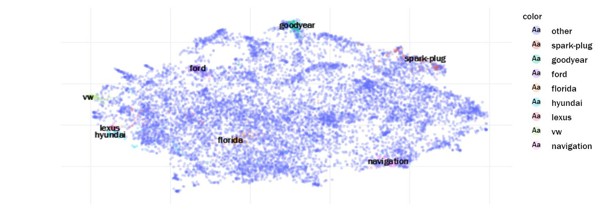
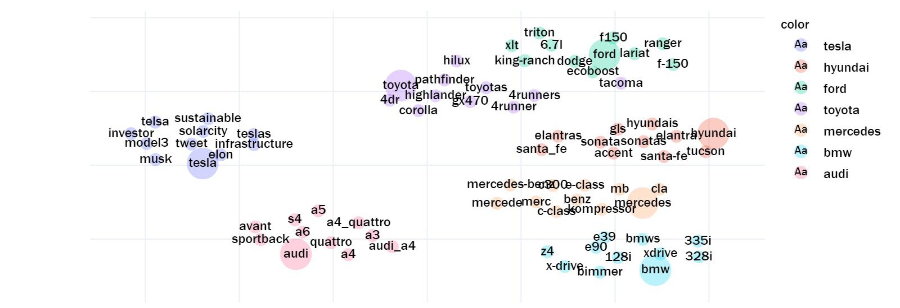
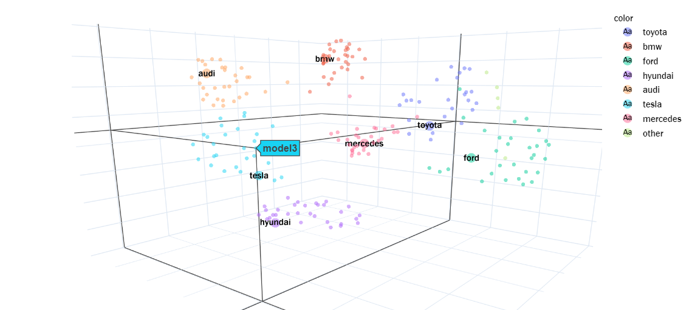
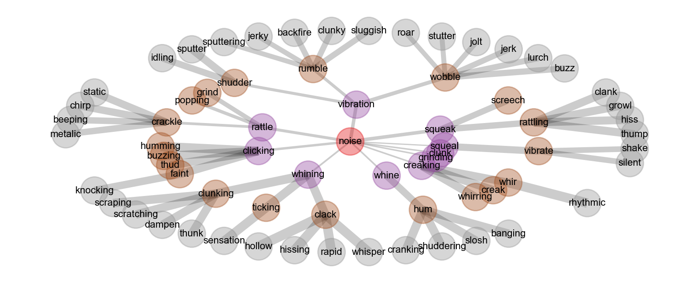
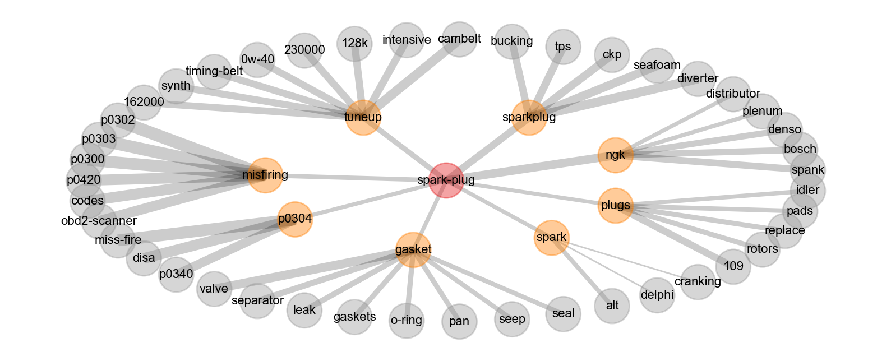

# Chapter 10: Exploring Semantic Relationships with Word Embeddings

## [Blueprints for Text Analysis Using Python](https://github.com/blueprints-for-text-analytics-python/blueprints-text)

**If you like the book or the code examples here, please leave a friendly comment on 
[Amazon](https://www.amazon.com/Blueprints-Text-Analytics-Using-Python/dp/149207408X)!** 

View Jupyter notebook on 
[[Github](Embeddings.ipynb)] or
[[nbviewer](https://nbviewer.ipython.org/github/blueprints-for-text-analytics-python/blueprints-text/blob/master/ch10/Embeddings.ipynb)] or run it on
[[Colab](https://colab.research.google.com/github/blueprints-for-text-analytics-python/blueprints-text/blob/master/ch10/Embeddings.ipynb)].

## Figures

Figure 10-3. 2d-UMAP projections of all word embeddings

Figure 10-4. 2d-UMAP projections of selected keywords

Figure 10-5. 3d-UMAP projections of selected keywords

Figure 10-7. Similarity tree of words most similar to “noise” their most similar words

Figure 10-8. Similarity tree of words most similar to “spark-plug” their most similar words

