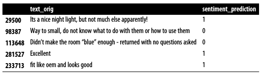

# Chapter 11: Performing Sentiment Analysis on Text Data

## [Blueprints for Text Analysis Using Python](https://github.com/blueprints-for-text-analytics-python/blueprints-text)

**If you like the book or the code examples here, please leave a friendly comment on 
[Amazon](https://www.amazon.com/Blueprints-Text-Analytics-Using-Python/dp/149207408X)!** 

View Jupyter notebook on 
[[Github]](Sentiment_Analysis.ipynb) or
[[nbviewer](https://nbviewer.ipython.org/github/blueprints-for-text-analytics-python/blueprints-text/blob/master/ch11/Sentiment_Analysis.ipynb)] or run it on 
[[Colab](https://colab.research.google.com/github/blueprints-for-text-analytics-python/blueprints-text/blob/master/ch11/Sentiment_Analysis.ipynb)].

## Figures

Illustration of identifying positive and negative sentiment expressed by customers in online product reviews.

