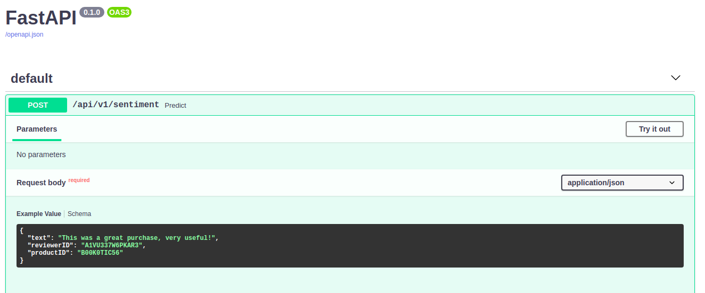
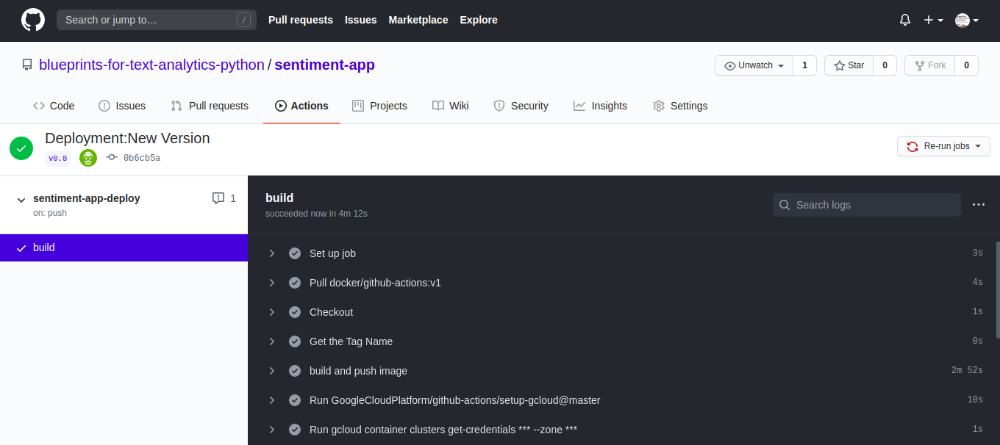

# Chapter 13: Using Text Analytics in Production

## [Blueprints for Text Analysis Using Python](https://github.com/blueprints-for-text-analytics-python/blueprints-text)

**If you like the book or the code examples here, please leave a friendly comment on
[Amazon](https://www.amazon.com/Blueprints-Text-Analytics-Using-Python/dp/149207408X)!**

View an example of the REST API on 
[[Github]](https://github.com/blueprints-for-text-analytics-python/sentiment-app) 

## Figures

Illustration of automated API docs generated for the REST API

Illustrating automated builds using GitHub actions

